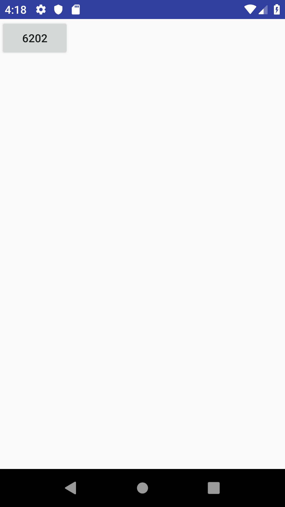
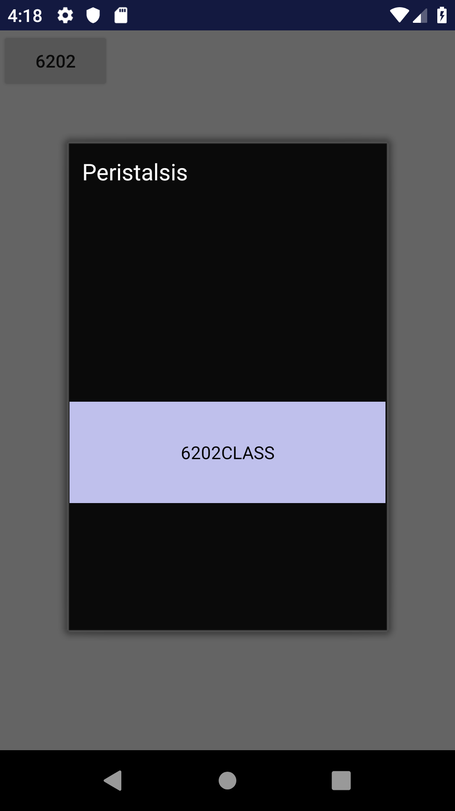
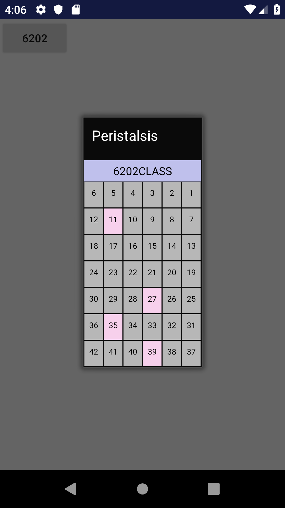

# PHP_Stud
php 독학- 19/01/04 ~

* * * 
  - 1/4 11:13 php 기본 개념과 설치. -[생활코딩](https://opentutorials.org/course/62/233)
    - ~ [Android Studio-Mysql 연동](https://m.blog.naver.com/alice_k106/220504885730) , [연동 후 json parsing](https://m.blog.naver.com/PostView.nhn?blogId=alice_k106&logNo=220504919176) ,     [resultSet 기본조작](http://php.net/manual/kr/function.mysql-result.php) , [Android 8: Cleartext HTTP traffic not permitted 에러 해결(Option 2)](https://stackoverflow.com/questions/45940861/android-8-cleartext-http-traffic-not-permitted)
  - 1/5 00:53 기존 프로젝트 데이터베이스 안드로이드에 연동 성공- 콘솔 출력 성공- 레이아웃에 resultSet add 후 출력 성공.
    - 현재로선 json 형태도, 기존 resultSet 형태도 완벽히 조작하지 못해 select한 테이블 전체 덩어리를 출력.
    - 목표 - 성공적인 parsing 후, 각 데스크탑의 상태,번호 등의 칼럼별 정보를 변수화 후 구상대로  구현.
  - 1/18 00:45 기존 프로젝트 데이터베이스와 안드로이드 스튜디오 확실한 연동- ip가 계속 바뀜-
    - 기존 프로젝트에서 사용했던 getLocalHostLANAddress? 메소드 활용 시도- 실패. eclipse와 안스의 패키지 차이 존재?
    - 그냥 각 실행시 개별적으로 ip 수정.
    - php 파일에서 결과값 프로젝트 데이터베이스의 pc 테이블 resultset의 각 row , 한개의 행 속 세개의 튜플?중 하나(number, status, temp중 status)를 개별적으로 활용하려 하였으나 순차적으로 사용해야 하는듯 ___
    
    ```php 
    echo "\"Num\":\"$row[PC_NUMBER]\", \"Status\":\"$row[PC_STATUS]\", \"Temp\":\"$row[PC_TEMP]\"";
    ```
    위와 같은 상황에서 
    ```php
    echo "\"Status\":\"$row[PC_STATUS]\"";
    ```
    로 변환해 본 결과 공백이 출력됨. 하지만
    ```php
    echo "\"Status\":\"$row[PC_NUMBER]\"";
    ```
    처럼 row의 가장 앞 튜플을 출력할 경우 올바른 번호 출력됨. 
    - /////// php 업데이트 지연으로 생긴 에러였음. php 코드 단축해 필요한 status만 활용 가능하도록 변환.
    ```php
    <?php 
    $conn = mysqli_connect("localhost", "root", "qq192837qq", "pj_pc");
    $query = "select * from pc";
    if($result = mysqli_query($conn, $query)){
        $row_num = mysqli_num_rows($result);
        for($i = 0; $i < $row_num; $i++){
            $row = mysqli_fetch_array($result);
            echo "$row[PC_STATUS]";
        }
    }
    else{
        echo "failed to get data from database.";
    }
    ?>
    ```
    - String[] result로 데이터 받고 스플릿해 사용.
    ```java
        test = "http://121.125.203.54/Connect1.php";
        task = new URLConnector(test);
        task.start();

        try {
            task.join();
            System.out.println("waiting... for result");
        } catch (InterruptedException e) {

        }

        String result = task.getResult();
        int stat=-1;
        try {
            JSONObject root=new JSONObject(result);

            JSONArray ja = root.getJSONArray("result");

            for(int i = 0; i < ja.length();i++) {
                JSONObject jo = ja.getJSONObject(i);
                stat = jo.getInt("PC_STATUS");
            }
        }
        catch (JSONException e) {
            e.printStackTrace();
        }

        System.out.println(result);

        String[] s;
        s=result.trim().split("");
    ```
    - 시연 상태의 프로젝트 파일과 비슷하게 팝업형식으로 레이아웃 작성, 버튼 클릭시 데이터 받아오도록 구현.
    - 스무스하게 업데이트, 업그레이드 성공. 
    - 심플한 창에 데스크탑 상태들만 표기되도록 변경.
    - 42개 좌석 설정을 개판으로 했는지 정확한 번호의 데스크탑이 변경되지 않음.
    - 
    - 
    - 
    - 
 
